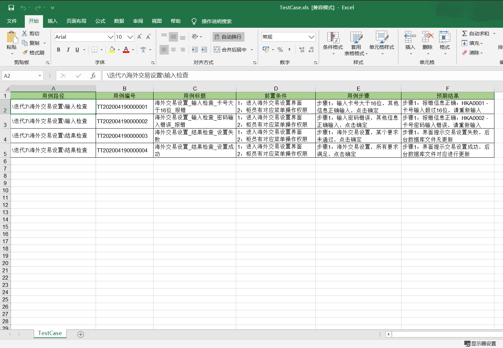
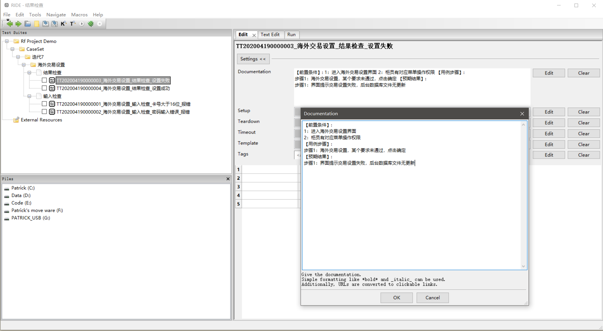

`generate test-suite.robot in your robotframework project from the test case excel you given, include the testcase number, title,prepare and step and expected result
`

`excel_config.json: 主要是配置用例所在sheet的sheetName以及用例属性对应中文映射, 如下:`

```json
{
  "caseSheet": "TestCase",
  "casePath": "用例路径",
  "caseNo": "用例编号",
  "caseTitle": "用例标题",
  "casePrep": "前置条件",
  "caseStep": "用例步骤",
  "caseExpt": "预期结果"
}
```

```python
# 调用rf_case_generator模块下的write_case_to_rf方法即可

from rf_case_generator import write_case_to_rf

rf_path = "希望导入用例的目录的绝对路径"
excel = "用例excel的绝对路径"
write_case_to_rf(rf_path, excel)

# 本地运行后结果如下:
```

excel中用例如下：



生成RF用例如下：


